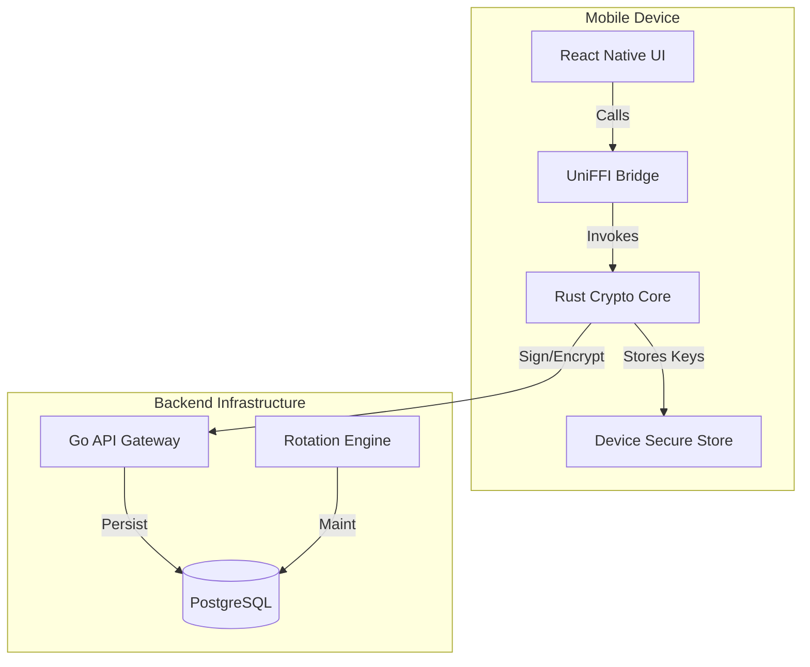

# OmniAuth Monorepo
### Quantum-Proof Identity & Authentication Platform

OmniAuth is a next-generation security platform built to withstand the threat of quantum computing. By integrating Post-Quantum Cryptography (PQC) directly into the authentication flow, OmniAuth ensures that today's sensitive data remains secure against tomorrow's threats.

## 🚀 Key Features

- **🛡️ Quantum-Proof Core**: Built on **CRYSTALS-Kyber** (Key Encapsulation) and **CRYSTALS-Dilithium** (Digital Signatures), NIST-standardized algorithms for the post-quantum era.
- **📱 Zero-Trust Mobile Client**: A React Native mobile app that generates and stores keys locally on the device's Secure Enclave/KeyStore, ensuring private keys never leave the user's possession.
- **⚡ High-Performance Architecture**:
  - **Rust Core**: Critical cryptographic operations run in a highly optimized, memory-safe Rust crate.
  - **Go Backend**: Scalable, concurrent microservices handling API requests and orchestrating authentication flows.
  - **UniFFI Bindings**: Seamless, type-safe bindings between the Rust core and mobile clients (Kotlin/Swift).
- **🔒 Secure by Design**: Implements `Zeroize` for secure memory wiping and strict type safety to prevent common vulnerabilities.

## 🏗️ Architecture



## 📂 Project Structure

This monorepo follows a strict separation of concerns between Open Source reference implementations and Proprietary business logic.

### `oss/` (The "Trust" Layer)
*Open Source, Audit-Ready Core Components*
- **`crypto-core/`**: The heart of the platform. A Rust crate implementing PQC algorithms.
- **`client-mobile/`**: Reference mobile application built with React Native (Expo) and TypeScript.

### `proprietary/` (The "SaaS" Layer)
*Business Logic & Cloud Infrastructure*
- **`backend/`**: Go services including the API Gateway (`cmd/api`) and Workers (`cmd/worker`).
- **`admin-dashboard/`**: Internal tooling for managing tenants and users.

### `infra/`
- **`terraform/`**: Infrastructure as Code definitions.
- **`docker/`**: Containerization setups for local dev and production.

## 🛠️ Getting Started

### Prerequisites
- **Rust**: 1.70+ (`rustup update`)
- **Go**: 1.21+
- **Node.js**: 18+ (LTS)
- **Yarn/npm**: For managing JS dependencies.
- **Docker**: For running local database instances.

### Installation

1. **Clone the Repository**
   ```bash
   git clone https://github.com/sauravsvt/OmniAuth.git
   cd OmniAuth
   ```

2. **Initialize Dependencies**
   ```bash
   # Install generic dependencies (adjust based on your tooling, e.g., Turborepo)
   npm install
   ```

3. **Build Crypto Core**
   ```bash
   cd oss/crypto-core
   cargo build --release
   ```

4. **Run Backend (Local)**
   ```bash
   cd proprietary/backend
   go run cmd/server/main.go
   ```

5. **Start Mobile App**
   ```bash
   cd oss/client-mobile
   npx expo start
   ```

## 📜 License
- **OSS Components**: MIT License (See [LICENSE](LICENSE))
- **Proprietary Components**: Proprietary License (See [LICENSE-PROPRIETARY](LICENSE-PROPRIETARY))
