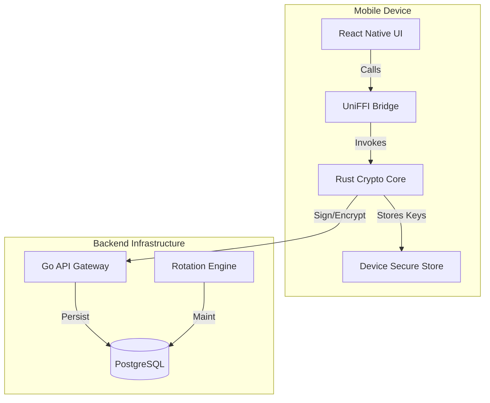

# OmniAuth Monorepo

> [!WARNING]
> **EXPERIMENTAL CRYPTOGRAPHY / NOT AUDITED**
> OmniAuth is a prototype/reference implementation exploring post-quantum authentication flows.
> It has not been independently audited. Do not use to protect high-value assets or classified data.

[](https://github.com/sauravsvt/OmniAuth/actions/workflows/ci.yml)

### Post-Quantum Identity & Authentication Platform (Prototype)

OmniAuth integrates post-quantum cryptography (PQC) into an authentication flow using NIST-standardized primitives:
- **ML-KEM-768 (FIPS 203)** for key encapsulation
- **ML-DSA-65 (FIPS 204)** for signatures (formerly "Dilithium3")

This repo focuses on correctness, test coverage, and clear threat-model boundaries — not production certification.

## 🚀 Key Features

- **🛡️ Hardened Crypto Core (Rust)**
  - **Transient Secrets**: Private keys exist in memory *only* for the duration of a single operation (`sign`, `recover_shared_secret`). There is no long-lived `Identity` object.
  - **Encrypted Vault at Rest**: Vault persists only an encrypted blob (XChaCha20-Poly1305 + Argon2id).
  - **Memory Hygiene**: Key-encryption keys (KEK) and plaintext buffers are wiped using `zeroize` where possible. Note: Upstream `pqcrypto` key types may not fully zeroize on drop.
  - **Versioned Vault Format + AAD**: Vault blobs are versioned and authenticated with associated data (AAD) to prevent silent tampering.
  - **Standards-Aligned Primitives**: Implements the ML-KEM-768 parameter set (FIPS 203) and ML-DSA-65 parameter set (FIPS 204).

- **📱 Zero-Trust Mobile Client (Reference)**
  - React Native (Expo) client that generates keys locally.
  - Optional platform-backed storage (e.g., KeyStore / Secure Enclave) depending on device/OS support.

- **⚡ High-Performance Architecture**
  - Rust crypto core + UniFFI bindings (Kotlin/Swift)
  - Go backend microservices for orchestration and verification

## 🔬 Notes on "Quantum-Safe"
PQC reduces risk from "harvest now, decrypt later" attacks, but security depends on the full protocol (challenge freshness, replay resistance, device binding, recovery, etc.). OmniAuth is an evolving reference implementation.

## 🏗️ Architecture



## 📂 Project Structure

This monorepo follows a strict separation of concerns between Open Source reference implementations and Proprietary business logic.

### `oss/` (The "Trust" Layer)
*Open Source, Audit-Ready Core Components*
- **`crypto-core/`**: The heart of the platform. A Rust crate implementing PQC algorithms.
- **`client-mobile/`**: Reference mobile application built with React Native (Expo) and TypeScript.

### `proprietary/` (The "SaaS" Layer)
*Business Logic & Cloud Infrastructure*
- **`backend/`**: Go services including the API Gateway (`cmd/server`) and Workers (`cmd/worker`).
- **`admin-dashboard/`**: Internal tooling for managing tenants and users.

### `infra/`
- **`terraform/`**: Infrastructure as Code definitions.
- **`docker/`**: Containerization setups for local dev and production.

## 🛠️ Getting Started

### Prerequisites
- **Rust**: 1.70+ (`rustup update`)
- **Go**: 1.22+
- **Node.js**: 18+ (LTS)
- **Yarn/npm**: For managing JS dependencies.
- **Docker**: For running local database instances.

### Installation

1. **Clone the Repository**
   ```bash
   git clone https://github.com/sauravsvt/OmniAuth.git
   cd OmniAuth
   ```

2. **Initialize Dependencies**
   ```bash
   npm install
   ```

3. **Build Crypto Core**
   ```bash
   cd oss/crypto-core
   cargo build --release
   ```

4. **Run Backend (Local)**
   ```bash
   cd proprietary/backend
   go run cmd/server/main.go
   ```

5. **Start Mobile App**
   ```bash
   cd oss/client-mobile
   npx expo start
   ```

# OmniAuth Testing Guide

This guide lists the current automated test suites, what each one covers, and how to run them.

---

## Prerequisites
- Node.js 18+ and npm
- Rust (stable toolchain via rustup)
- Go 1.22+
- For mobile runtime checks: Expo CLI, Android Studio and/or Xcode (macOS).

---

## Test Matrix
- **Rust core** (`oss/crypto-core`):
  - `test_vault_lifecycle_transient`: Creates vault, signs transiently, restores from blob.
  - `test_wrong_password`: Verifies `InvalidPassword` on incorrect credentials.
  - `test_corrupted_nonce_length`: Verifies `CorruptedVault` on tampered nonce.
  - `test_kem_flow_via_vault`: Validates KEM encapsulation/decapsulation via Vault.
  - `interop_tests` (gated/disabled): Generates vectors for Go verification; currently disabled pending encoding/spec alignment between Rust and Go PQC libraries.

- **Go backend** (`proprietary/backend`):
  - `ValidSignature`, `InvalidSignature`, `WrongMessage`, `InvalidPublicKeyFormat`: Signature verification tests.
  - `TestReplayProtection`: Protocol-level test demonstrating challenge-response replay protection.
  - `TestHealthEndpoint`, `TestVerifyEndpoint`: API integration tests.

- **Mobile client** (`oss/client-mobile`):
  - `createVault`, `getPublicKey`, `signChallenge`: Native bridge mocks.

---

## How to Run Automated Tests

### 1) Rust crypto core
```bash
cd oss/crypto-core
cargo test
```
Last run: ✅ `4 passed, 1 ignored` (warnings: none).

To run the ignored interop vector generation test:
```bash
cargo test generate_interop_vectors -- --ignored
```
Last run: ✅ `1 passed`.

### 2) Go backend
```bash
cd proprietary/backend
go test ./...
```
Last run: ✅ `ok`.

### 3) Mobile client unit tests (Jest)
```bash
cd oss/client-mobile
npm install
npm test
```
Last run: ✅ `1 passed` (3 tests).

---

## Troubleshooting
- If Rust tests fail to compile, ensure `rustup update` has installed the stable toolchain.
- If Go tests cannot find modules, run `go mod tidy` inside `proprietary/backend`.
- For mobile tests, clear Jest cache with `npm test -- --clearCache` if mocks are stale.

## 📜 License
- **OSS Components**: GNU AGPL v3.0 (See [LICENSE](LICENSE)). Copyright (c) 2025 Saurav Shriwastav.
- **Proprietary Components**: Proprietary License (See [LICENSE-PROPRIETARY](LICENSE-PROPRIETARY)). All Rights Reserved.

## 🗺️ Roadmap
- Enable interop tests after FIPS library alignment.
- NIST selected HQC in March 2025 as a backup encryption algorithm to ML-KEM; consider integration.


COMING UP
3.New cryptographic construction (hard, PhD-level)
2. Formal proof of security (Tamarin, ProVerif)
1. Solving an unsolved practical problem (key rotation at scale, threshold PQC)