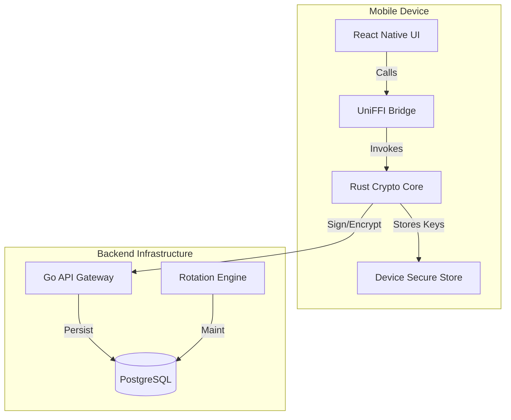

# OmniAuth Monorepo
[](https://github.com/sauravsvt/OmniAuth/actions/workflows/ci.yml)
### Quantum-Proof Identity & Authentication Platform

OmniAuth is a next-generation security platform built to withstand the threat of quantum computing. By integrating Post-Quantum Cryptography (PQC) directly into the authentication flow, OmniAuth ensures that today's sensitive data remains secure against tomorrow's threats.

## 🚀 Key Features

- **🛡️ Quantum-Proof Core**: Built on **CRYSTALS-Kyber** (Key Encapsulation) and **CRYSTALS-Dilithium** (Digital Signatures), NIST-standardized algorithms for the post-quantum era.
- **📱 Zero-Trust Mobile Client**: A React Native mobile app that generates and stores keys locally on the device's Secure Enclave/KeyStore, ensuring private keys never leave the user's possession.
- **⚡ High-Performance Architecture**:
  - **Rust Core**: Critical cryptographic operations run in a highly optimized, memory-safe Rust crate.
  - **Go Backend**: Scalable, concurrent microservices handling API requests and orchestrating authentication flows.
  - **UniFFI Bindings**: Seamless, type-safe bindings between the Rust core and mobile clients (Kotlin/Swift).
- **🔒 Secure by Design**: Implements `Zeroize` for secure memory wiping and strict type safety to prevent common vulnerabilities.

## 🏗️ Architecture



## 📂 Project Structure

This monorepo follows a strict separation of concerns between Open Source reference implementations and Proprietary business logic.

### `oss/` (The "Trust" Layer)
*Open Source, Audit-Ready Core Components*
- **`crypto-core/`**: The heart of the platform. A Rust crate implementing PQC algorithms.
- **`client-mobile/`**: Reference mobile application built with React Native (Expo) and TypeScript.

### `proprietary/` (The "SaaS" Layer)
*Business Logic & Cloud Infrastructure*
- **`backend/`**: Go services including the API Gateway (`cmd/server`) and Workers (`cmd/worker`).
- **`admin-dashboard/`**: Internal tooling for managing tenants and users.

### `infra/`
- **`terraform/`**: Infrastructure as Code definitions.
- **`docker/`**: Containerization setups for local dev and production.

## 🛠️ Getting Started

### Prerequisites
- **Rust**: 1.70+ (`rustup update`)
- **Go**: 1.21+
- **Node.js**: 18+ (LTS)
- **Yarn/npm**: For managing JS dependencies.
- **Docker**: For running local database instances.

### Installation

1. **Clone the Repository**
   ```bash
   git clone https://github.com/sauravsvt/OmniAuth.git
   cd OmniAuth
   ```

2. **Initialize Dependencies**
   ```bash
   # Install generic dependencies (adjust based on your tooling, e.g., Turborepo)
   npm install
   ```

3. **Build Crypto Core**
   ```bash
   cd oss/crypto-core
   cargo build --release
   ```

4. **Run Backend (Local)**
   ```bash
   cd proprietary/backend
   go run cmd/server/main.go
   ```

5. **Start Mobile App**
   ```bash
   cd oss/client-mobile
   npx expo start
   ```

# OmniAuth Testing Guide

This guide lists the current automated test suites, what each one covers, and how to run them. Follow the quick start to validate all layers (Rust core, Go backend, mobile client).

---

## Prerequisites
- Node.js 18+ and npm
- Rust (stable toolchain via rustup)
- Go 1.21+
- For mobile runtime checks: Expo CLI (`npm install -g expo-cli`), Android Studio and/or Xcode (macOS).

Verify installations:
```bash
node -v && npm -v
cargo --version
go version
```

---

## Test Matrix (what each suite covers)
- Rust core (`oss/crypto-core`):
  - `test_vault_lifecycle_hardened`: creates a vault, encrypts/exports the blob, restores from the blob, and signs a payload.
  - `test_wrong_password`: ensures decrypting with an incorrect password returns `InvalidPassword`.
- Go backend (`proprietary/backend`):
  - `ValidSignature`: verifies a valid Dilithium signature is accepted.
  - `InvalidSignature`: tampered signature is rejected.
  - `WrongMessage`: signature for the wrong challenge is rejected.
  - `InvalidPublicKeyFormat`: malformed base64 public keys are rejected.
  - **`TestHealthEndpoint`**: ensures API gateway is reachable.
  - **`TestVerifyEndpoint`**: full integration test of the HTTP API (valid & invalid flows).
- Mobile TypeScript unit tests (`oss/client-mobile`):
  - `createVault` returns success via the native bridge mock.
  - `getPublicKey` returns the mocked base64 key.
  - `signChallenge` returns the signed nonce prefix.

---

## How to Run Automated Tests (latest results)

### 1) Rust crypto core
```bash
cd oss/crypto-core
cargo test
```
Last run: ✅ `2 passed` (warnings: none).

### 2) Go backend
```bash
cd proprietary/backend
go test ./...
```
Last run: ✅ `ok` (server and crypto packages passed).

### 3) Mobile client unit tests (Jest)
```bash
cd oss/client-mobile
npm install
npm test
```
Last run: ✅ `1 passed` (3 tests).

---

## Manual end-to-end sanity check (optional)
1) Start backend worker (verifier):
```bash
cd proprietary/backend
go run cmd/worker/main.go
```
2) Launch the Expo app:
```bash
cd oss/client-mobile
npm install
npm start
```
3) In the app:
- Enter a password and tap **Generate Identity**.
- Expect "Vault Created & Unlocked".
- Tap **Test Signing** to see a success alert with signature length. Backend logs should show verification success when connected.

---

## Troubleshooting
- If Rust tests fail to compile, ensure `rustup update` has installed the stable toolchain.
- If Go tests cannot find modules, run `go mod tidy` inside `proprietary/backend`.
- For mobile tests, clear Jest cache with `npm test -- --clearCache` if mocks are stale.


## 📜 License
- **OSS Components**: MIT License (See [LICENSE](LICENSE))
- **Proprietary Components**: Proprietary License (See [LICENSE-PROPRIETARY](LICENSE-PROPRIETARY))
