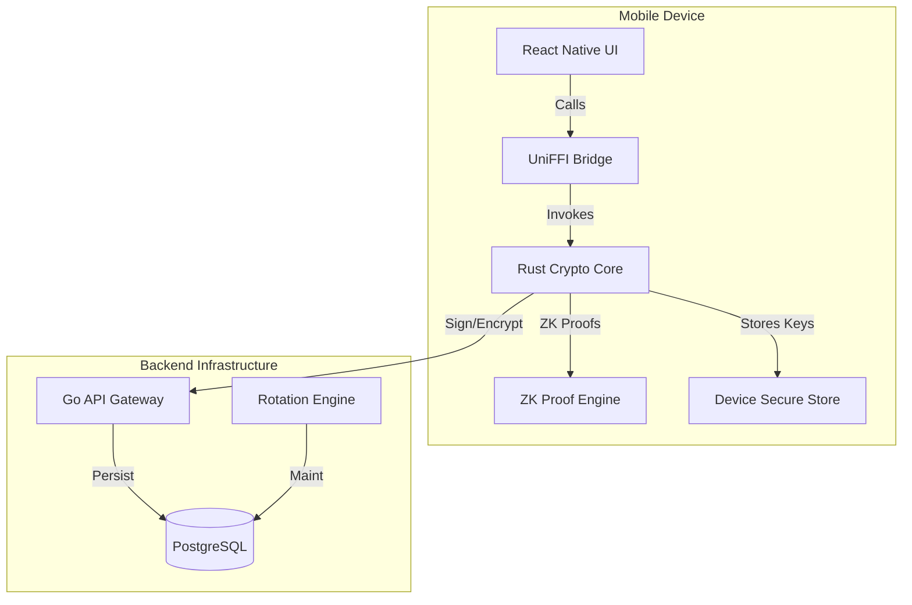

# OmniAuth Monorepo

> [!WARNING]
> **EXPERIMENTAL CRYPTOGRAPHY / NOT AUDITED**
> OmniAuth is a prototype/reference implementation exploring post-quantum authentication flows.
> It has not been independently audited. Do not use to protect high-value assets or classified data.

[](https://github.com/sauravsvt/OmniAuth/actions/workflows/ci.yml)

### Post-Quantum Identity & Authentication Platform (Prototype)

OmniAuth integrates post-quantum cryptography (PQC) into an authentication flow using NIST-standardized primitives:
- **ML-KEM-768 (FIPS 203)** for key encapsulation
- **ML-DSA-65 (FIPS 204)** for signatures (formerly "Dilithium3")

This repo focuses on correctness, test coverage, and clear threat-model boundaries — not production certification.

## Key Features

- **Hardened Crypto Core (Rust)**
  - **Transient Secrets**: Private keys exist in memory *only* for the duration of a single operation (`sign`, `recover_shared_secret`). There is no long-lived `Identity` object exposed via FFI.
  - **Encrypted Vault at Rest**: Vault persists only an encrypted blob (XChaCha20-Poly1305 + Argon2id).
  - **Memory Hygiene**: Key-encryption keys (KEK) and plaintext buffers are wiped using `zeroize` where possible. Note: Upstream `pqcrypto` key types may not fully zeroize on drop.
  - **Versioned Vault Format + AAD**: Vault blobs are versioned and authenticated with associated data (AAD) to prevent silent tampering.
  - **Standards-Aligned Primitives**: Implements the ML-KEM-768 parameter set (FIPS 203) and ML-DSA-65 parameter set (FIPS 204).

- **Zero-Knowledge Identity Claims (Rust, arkworks)**
  - **Groth16 proofs on BN254** for privacy-preserving attribute verification.
  - **Age Proof**: Prove `age >= threshold` without revealing birth date.
  - **Range Proof**: Prove `min <= value <= max` without revealing the value.
  - **Sound bit decomposition**: Slack variables are constrained to 64 bits via bit decomposition, preventing finite-field wrap-around attacks.
  - **Standalone verifier**: Verifying keys can be exported and used independently of the prover.

- **Zero-Trust Mobile Client (Reference)**
  - React Native (Expo) client with UniFFI-generated native bindings.
  - Vault-based architecture: password required for every cryptographic operation (no long-lived unlocked state).
  - Optional platform-backed storage (e.g., KeyStore / Secure Enclave) depending on device/OS support.

- **High-Performance Architecture**
  - Rust crypto core + UniFFI bindings (Kotlin/Swift)
  - Go backend microservices for orchestration and verification (Cloudflare CIRCL)

## Notes on "Quantum-Safe"
PQC reduces risk from "harvest now, decrypt later" attacks, but security depends on the full protocol (challenge freshness, replay resistance, device binding, recovery, etc.). OmniAuth is an evolving reference implementation.

## Architecture


```mermaid
graph TD
    subgraph MobileDevice [Mobile Device]
        UI[React Native UI]
        Bridge[UniFFI Bridge]
        RustCore[Rust Crypto Core]
        ZKEngine[ZK Proof Engine]
        SecureStore[Device Secure Store]
    end

    subgraph BackendInfra [Backend Infrastructure]
        API[Go API Gateway]
        DB[(PostgreSQL)]
        Worker[Rotation Engine]
    end

    UI -->|Calls| Bridge
    Bridge -->|Invokes| RustCore
    RustCore -->|ZK Proofs| ZKEngine
    RustCore -->|Stores Keys| SecureStore
    RustCore -->|Sign/Encrypt| API
    API -->|Persist| DB
    Worker -->|Maint| DB
```

## Project Structure

This monorepo follows a strict separation of concerns between Open Source reference implementations and Proprietary business logic.

### `oss/` (The "Trust" Layer)
*Open Source, Audit-Ready Core Components*
- **`crypto-core/`**: The heart of the platform. A Rust crate implementing PQC algorithms and ZK circuits.
  - `src/lib.rs` — Vault, KEM, signing APIs
  - `src/zk/` — Zero-knowledge proof circuits, prover, verifier, interop vectors
- **`client-mobile/`**: Reference mobile application built with React Native (Expo) and TypeScript.

### `proprietary/` (The "SaaS" Layer)
*Business Logic & Cloud Infrastructure*
- **`backend/`**: Go services including the API Gateway (`cmd/server`) and Workers (`cmd/worker`).
- **`backend/db/`**: PostgreSQL schema for users and rotation jobs.

## Getting Started

### Prerequisites
- **Rust**: 1.70+ (`rustup update`)
- **Go**: 1.22+
- **Node.js**: 18+ (LTS)
- **npm**: For managing JS dependencies.

### Installation

1. **Clone the Repository**
   ```bash
   git clone https://github.com/sauravsvt/OmniAuth.git
   cd OmniAuth
   ```

2. **Build Crypto Core**
   ```bash
   cd oss/crypto-core
   cargo build --release
   ```

3. **Run Backend (Local)**
   ```bash
   cd proprietary/backend
   go run cmd/server/main.go
   ```

4. **Start Mobile App**
   ```bash
   cd oss/client-mobile
   npm install
   npx expo start
   ```

---

## Testing Guide

### Prerequisites
- Rust (stable toolchain via rustup)
- Go 1.22+
- Node.js 18+ and npm
- For mobile runtime checks: Expo CLI, Android Studio and/or Xcode (macOS).

### Test Matrix

**Rust core** (`oss/crypto-core`) — 21 tests:

| Category | Tests |
|----------|-------|
| Vault | `test_vault_lifecycle_transient`, `test_wrong_password`, `test_corrupted_nonce_length` |
| KEM | `test_kem_flow_via_vault` |
| ZK Circuits | `test_age_circuit_satisfiable_adult`, `test_age_circuit_exactly_at_threshold`, `test_age_circuit_rejects_minor`, `test_age_circuit_rejects_one_year_short`, `test_range_circuit_in_bounds`, `test_range_circuit_at_bounds`, `test_range_circuit_rejects_below_min`, `test_range_circuit_rejects_above_max`, `test_range_circuit_rejects_far_out_of_range`, `test_range_circuit_single_value_range` |
| ZK Prover | `test_age_proof_generation_and_verification`, `test_age_proof_exactly_at_threshold`, `test_range_proof_valid`, `test_range_proof_at_bounds`, `test_proof_serialization_roundtrip`, `test_vk_export` |
| ZK Verifier | `test_verifier_with_exported_key` |
| Interop (ignored) | `generate_interop_vectors`, `generate_zk_interop_vectors` |

**Go backend** (`proprietary/backend`):
- `ValidSignature`, `InvalidSignature`, `WrongMessage`, `InvalidPublicKeyFormat`: Signature verification tests.
- `TestReplayProtection`: Protocol-level test demonstrating challenge-response replay protection.
- `TestHealthEndpoint`, `TestVerifyEndpoint_Success`, `TestVerifyEndpoint_InvalidSignature`: API integration tests.

**Mobile client** (`oss/client-mobile`) — 5 tests:
- `createVault`, `getPublicKey`, `signChallenge`, `exportBlob`, `restoreVault`: Native bridge mocks with async/await.

### How to Run

```bash
# Rust crypto core (21 tests)
cd oss/crypto-core
cargo test

# Go backend
cd proprietary/backend
go test ./...

# Mobile client (Jest)
cd oss/client-mobile
npm install
npm test -- --runInBand
npm run typecheck -- --noEmit
npm audit
env EXPO_NO_TELEMETRY=1 npx --yes expo-doctor
```

### Troubleshooting
- If Rust tests fail to compile, ensure `rustup update` has installed the stable toolchain.
- If Go tests cannot find modules, run `go mod tidy` inside `proprietary/backend`.
- For mobile tests, clear Jest cache with `npm test -- --clearCache` if mocks are stale.

---

## Security Properties

### Vault (PQC)
- Keys are encrypted at rest using XChaCha20-Poly1305 with an Argon2id-derived KEK.
- AAD (`OmniAuth-VaultBlob-v1`) binds the vault version to the ciphertext, preventing downgrade attacks.
- Private keys are decrypted only transiently and never returned to the caller.

### ZK Circuits
- **Soundness**: All inequality constraints use bit decomposition (64-bit) to prevent finite-field wrap-around. A prover cannot forge a proof for an out-of-range value.
- **Zero-Knowledge**: Private witnesses (birth date, secret value) are never included in public inputs.
- **Trusted Setup**: Current implementation uses per-instance `circuit_specific_setup`. Production deployment requires a proper Powers of Tau ceremony.

### Replay Protection
- The Go backend demonstrates challenge-response replay protection using single-use nonce consumption.

---

## License
- **OSS Components**: GNU AGPL v3.0 (See [LICENSE](LICENSE)). Copyright (c) 2025 Saurav Shriwastav.
- **Proprietary Components**: Proprietary License (See [LICENSE-PROPRIETARY](LICENSE-PROPRIETARY)). All Rights Reserved.

## Roadmap
- Enable Rust-to-Go interop tests after FIPS library encoding alignment.
- NIST selected HQC in March 2025 as a backup encryption algorithm to ML-KEM; consider integration.
- Formal proof of security (Tamarin, ProVerif) for the challenge-response protocol.
- Threshold PQC (t-of-n Dilithium signing) for key rotation and social recovery.
- Publish `omniauth_core` crate to crates.io after security audit.
